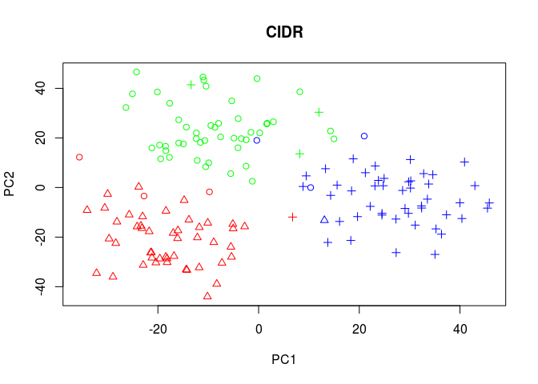
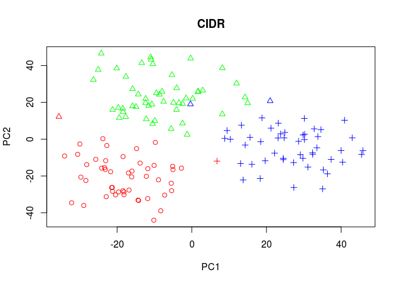

<!-- README.md is generated from README.Rmd. Please edit that file -->
CIDR - Clustering through Imputation and Dimensionality Reduction
=================================================================

Fast and accurate clustering through imputation and dimensionality reduction for single cell RNA-Seq data.

Most existing dimensionality reduction and clustering packages for single cell RNA-Seq (scRNA-Seq) data deal with dropouts by heavy modelling and computational machinery. Here we introduce *CIDR* (Clustering through Imputation and Dimensionality Reduction), an ultrafast algorithm which uses a novel yet very simple ‘implicit imputation’ approach to alleviate the impact of dropouts in scRNA-Seq data in a principled manner.

Getting Started
---------------

-   Make sure your version of R is at least 3.1.0
-   If you are on the Windows platorm, ensure that [Rtools](https://cran.r-project.org/bin/windows/Rtools/) is installed
-   install the *devtools* package which will be used to install *CIDR* and its dependencies:

``` r
install.packages("devtools")
```

-   Install the *CIDR* package directly from the Github repository (including any dependencies):

``` r
devtools::install_github("VCCRI/CIDR")
```

Example
=======

Test the newly installed *CIDR* package:

``` r
library(cidr)
example("cidr")
#> 
#> cidr> ## Generate simulated single cell RNA-Seq tags.
#> cidr> N=3 ## 3 cell types
#> 
#> cidr> k=50 ## 50 cells per cell type
#> 
#> cidr> sData <- scSimulator(N=N, k=k)
#> 
#> cidr> cols <- c(rep("RED",k), rep("BLUE",k), rep("GREEN",k))
#> 
#> cidr> ## Standard principal component analysis.
#> cidr> ltpm <- log2(t(t(sData$tags)/colSums(sData$tags))*1000000+1)
#> 
#> cidr> pca <- prcomp(t(ltpm))
#> 
#> cidr> plot(pca$x[,c(1,2)],col=cols,pch=1,xlab="PC1",ylab="PC2",main="prcomp")
```


    #> 
    #> cidr> ## Use cidr to analyse the simulated dataset.
    #> cidr> sData <- scDataConstructor(as.matrix(sData$tags))
    #> 
    #> cidr> sData <- determineDropoutCandidates(sData)
    #> 
    #> cidr> sData <- wThreshold(sData)


    #> 
    #> cidr> sData <- scDissim(sData)
    #> 
    #> cidr> sData <- scPCA(sData)


    #> 
    #> cidr> nCluster(sData)


    #> 
    #> cidr> sData <- scCluster(sData)
    #> 
    #> cidr> ## Two dimensional visualization: different colors denote different cell types,
    #> cidr> ## while different plotting symbols denote the clusters output by cidr.
    #> cidr> plot(sData@PC[,c(1,2)], col=cols,
    #> cidr+      pch=sData@clusters, main="CIDR", xlab="PC1", ylab="PC2")



    #> 
    #> cidr> ## Use Adjusted Rand Index to measure the accuracy of the clustering output by cidr.
    #> cidr> adjustedRandIndex(sData@clusters,cols)
    #> [1] 0.7895042
    #> 
    #> cidr> ## 0.79
    #> cidr> ## Alter the number of PCs used in the clustering.
    #> cidr> sData@nPC <- 2
    #> 
    #> cidr> sData <- scCluster(sData)
    #> 
    #> cidr> plot(sData@PC[,c(1,2)], col=cols,
    #> cidr+      pch=sData@clusters,main="CIDR",xlab="PC1", ylab="PC2")



    #> 
    #> cidr> adjustedRandIndex(sData@clusters,cols)
    #> [1] 0.9203693
    #> 
    #> cidr> ## 0.92
    #> cidr> 
    #> cidr> 
    #> cidr>
